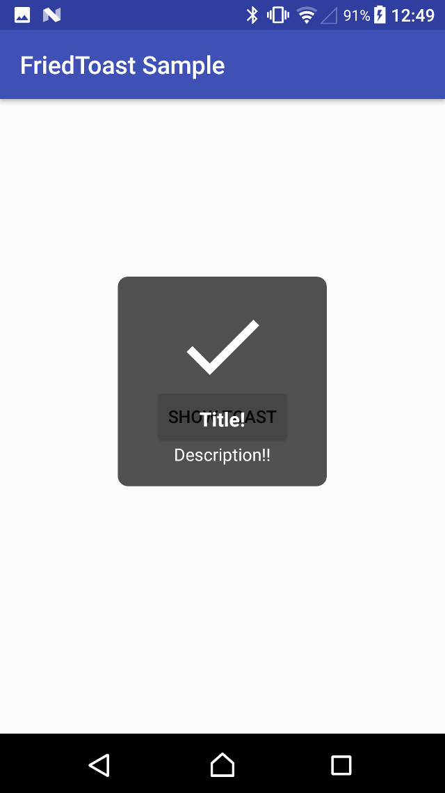

FriedToast
====

[](https://bintray.com/kazakago/maven/friedtoast/_latestVersion)
[]()
[](LICENSE.md)

A rich Toast library that can display images, titles, and descriptions.



## Requirement

- Android 4.0.3 (API 15) or later

## Install

Add the following gradle dependency exchanging x.x.x for the latest release.

```groovy
compile 'com.kazakago.friedtoast:friedtoast:x.x.x'
```

## Usage

The following is a sample to show FriedToast.

### Kotlin

```kotlin
fun showFriedToast(context: Context) {
    FriedToast.create(context)
            .setTitle("Title!")
            .setDescription("Description!!")
            .setIconImageResource(R.drawable.ic_done_white_80dp)
            .show()
    }
```

### Java

```java
void showFriedToast(Context context) {
    FriedToast.create(context)
            .setTitle("Title!")
            .setDescription("Description!!")
            .setIconImageResource(R.drawable.ic_done_white_80dp)
            .show();
}
```

Refer to the sample module ([Java](https://github.com/KazaKago/FriedToast/tree/master/samplejava) & [Kotlin](https://github.com/KazaKago/FriedToast/tree/master/samplekotlin)) for details.

## Changeable Property

```kotlin
/* Toast */

fun setDuration(duration: Int): FriedToastCoreInterface
fun setGravity(gravity: Int): FriedToastCoreInterface
fun setXOffset(xOffset: Int): FriedToastCoreInterface
fun setYOffset(yOffset: Int): FriedToastCoreInterface

/* View */

fun setAlpha(@FloatRange(from = 0.0, to = 1.0) alpha: Float): FriedToastCoreInterface
fun setMinimumWidth(width: Int): FriedToastCoreInterface
fun setMinimumHeight(height: Int): FriedToastCoreInterface
fun setBackgroundColor(@ColorInt color: Int): FriedToastCoreInterface
fun setBackgroundColorRes(@ColorRes colorRes: Int): FriedToastCoreInterface
fun setBackgroundCornerRadius(cornerRadius: Float): FriedToastCoreInterface

/* IconImageView */

fun setIconImageDrawable(drawable: Drawable?): FriedToastCoreInterface
fun setIconImageResource(@DrawableRes resourceId: Int): FriedToastCoreInterface
fun setIconImageBitmap(bitmap: Bitmap?): FriedToastCoreInterface
fun setIconScaleType(scaleType: ImageView.ScaleType): FriedToastCoreInterface
fun setIconColorFilter(colorFilter: ColorFilter): FriedToastCoreInterface
fun setIconColorFilter(@ColorInt color: Int, mode: PorterDuff.Mode): FriedToastCoreInterface
fun setIconColorFilterRes(@ColorRes color: Int, mode: PorterDuff.Mode): FriedToastCoreInterface
fun setIconColorFilter(@ColorInt color: Int): FriedToastCoreInterface
fun setIconColorFilterRes(@ColorRes color: Int): FriedToastCoreInterface

/* TitleTextView */

fun setTitle(text: CharSequence?): FriedToastCoreInterface
fun setTitle(@StringRes textRes: Int): FriedToastCoreInterface
fun setTitleTextSize(textSize: Float): FriedToastCoreInterface
fun setTitleTextColor(@ColorInt textColor: Int): FriedToastCoreInterface
fun setTitleTextColorRes(@ColorRes textColorRes: Int): FriedToastCoreInterface
fun setTitleTypeFace(typeFace: Typeface): FriedToastCoreInterface
fun setTitleGravity(gravity: Int): FriedToastCoreInterface

/* DescriptionTextView */

fun setDescription(text: CharSequence?): FriedToastCoreInterface
fun setDescription(@StringRes textRes: Int): FriedToastCoreInterface
fun setDescriptionTextSize(textSize: Float): FriedToastCoreInterface
fun setDescriptionTextColor(@ColorInt textColor: Int): FriedToastCoreInterface
fun setDescriptionTextColorRes(@ColorRes textColorRes: Int): FriedToastCoreInterface
fun setDescriptionTypeFace(typeFace: Typeface): FriedToastCoreInterface
fun setDescriptionGravity(gravity: Int): FriedToastCoreInterface
```

## Advanced

### Custom View

If you want to use the original View, create a class that inherits from `FriedToastCore`.  
and you need to implement following methodｓ.  

```kotlin
class CustomFriedToast(context: Context) : FriedToastCore(context) {

    companion object {
        @JvmStatic
        fun create(context: Context) = CustomFriedToast(context)
    }

    override fun onCreateView(inflater: LayoutInflater): View = inflater.inflate(YOUR_CUSTOM_VIEW_LAYOUT, null)

    override fun onCreateIconImageView(view: View): ImageView = view.findViewById(YOUR_CUSTOM_ICON_IMAGEVIEW_ID)

    override fun onCreateTitleTextView(view: View): TextView = view.findViewById(YOUR_CUSTOM_TITLE_TEXTVIEW_ID)

    override fun onCreateDescriptionTextView(view: View): TextView = view.findViewById(YOUR_CUSTOM_DESCRIPTION_TEXTVIEW_ID)

    override fun onCreateToast(toast: Toast): Toast = toast

}
```

## License
MIT License

Copyright (c) 2017 KazaKago

Permission is hereby granted, free of charge, to any person obtaining a copy
of this software and associated documentation files (the "Software"), to deal
in the Software without restriction, including without limitation the rights
to use, copy, modify, merge, publish, distribute, sublicense, and/or sell
copies of the Software, and to permit persons to whom the Software is
furnished to do so, subject to the following conditions:

The above copyright notice and this permission notice shall be included in all
copies or substantial portions of the Software.

THE SOFTWARE IS PROVIDED "AS IS", WITHOUT WARRANTY OF ANY KIND, EXPRESS OR
IMPLIED, INCLUDING BUT NOT LIMITED TO THE WARRANTIES OF MERCHANTABILITY,
FITNESS FOR A PARTICULAR PURPOSE AND NONINFRINGEMENT. IN NO EVENT SHALL THE
AUTHORS OR COPYRIGHT HOLDERS BE LIABLE FOR ANY CLAIM, DAMAGES OR OTHER
LIABILITY, WHETHER IN AN ACTION OF CONTRACT, TORT OR OTHERWISE, ARISING FROM,
OUT OF OR IN CONNECTION WITH THE SOFTWARE OR THE USE OR OTHER DEALINGS IN THE
SOFTWARE.
